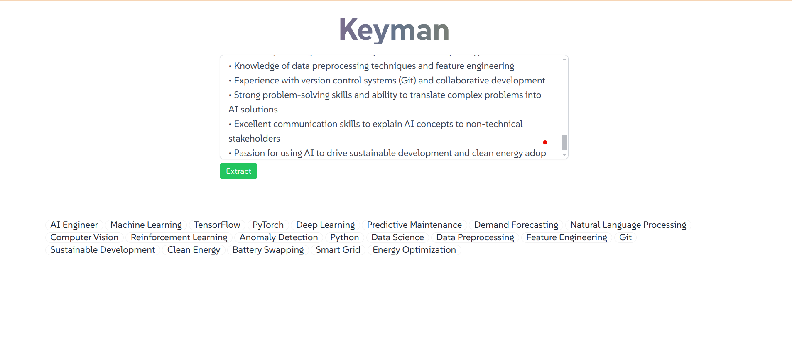

# Keyman



> Keyman is a FastAPI-based application designed to assist jobseekers by extracting job-relevant keywords from job descriptions. These keywords can be used to enhance CVs, making them more tailored to specific job postings.

## Features

- **Job Keyword Extraction**: Automatically extract relevant keywords from any job description provided.
- **FastAPI Framework**: Built with FastAPI, ensuring high performance and ease of use.
- **Integration with Groq API**: Leverages the Groq API for inference speed
- **HTMX Support**: Provides dynamic and interactive web pages without full page reloads.
- **Templating**: Uses Jinja2 templates for rendering HTML.

## Installation

### Prerequisites

- Python 3.11+
- Docker (optional for containerization)

### Clone the Repository

```bash
git clone https://github.com/Boadzie/keyman.git
cd keyman
```

### Create a Virtual Environment

```bash
python -m venv venv
source venv/bin/activate  # On Windows, use `venv\Scripts\activate`
```

### Install Dependencies

```bash
pip install -r requirements.txt
```

### Environment Variables

Create a `.env` file in the root directory and add the following environment variables:

```plaintext
GROQ_API_KEY=your_groq_api_key
```

### Run the Application

```bash
uvicorn app:app --reload
```

### Verify the Application

Visit `http://localhost:8000` in your web browser. If the application is running correctly, you should see a message indicating that "Keyman is running!"

## Usage

### Extract Keywords

1. Navigate to the homepage.
2. Enter the job description in the provided form.
3. Submit the form to receive a list of job-relevant keywords.

## Deployment

### Containerization with Docker

1. **Build the Docker Image**:

   ```bash
   docker build -t keyman_app .
   ```

2. **Run the Docker Container**:

   ```bash
   docker run -it -p 8000:8000 keyman_app
   ```

3. **Verify the Application**:

   Visit `http://localhost:8000` to ensure the application is running within the Docker container.

### Deploying to GCP Cloud Run

1. **Containerize the Application**: Ensure the application is wrapped in a Docker container.
2. **Deploy to Cloud Run**: Follow the steps in the GCP Cloud Run documentation to deploy your containerized application.

## Contributing

1. Fork the repository.
2. Create a new branch: `git checkout -b feature/your-feature-name`.
3. Make your changes.
4. Commit your changes: `git commit -m 'Add some feature'`.
5. Push to the branch: `git push origin feature/your-feature-name`.
6. Submit a pull request.

## License

This project is licensed under the MIT License. See the [LICENSE](LICENSE) file for details.

## Contact

For any inquiries or issues, please contact [https://www.linkedin.com/in/boadzie/](https://www.linkedin.com/in/boadzie/)
